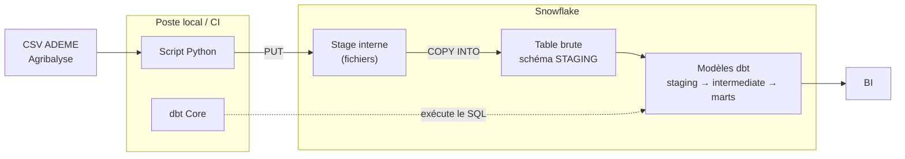

Trial Snowflake activé le 21/07/2026 — échéance ~20/08/2026 (30 j OU 400$, premier atteint)

# agribalyse — Analytics dbt

Projet dbt en cours de construction sur les données agribalyse, version 3.2, mis à jour le 27 février 2025.

Agribalyse est une base de données qui indique l'impact environemmental des produits agricoles qui sont produits ou consommés en France. Elle a pour but de soutenir la transition environnementale des systèmes agricoles et alimentaires.

**Source** : https://data.ademe.fr/datasets/agribalyse-31-detail-par-ingredient

## Stack

- Python 3.10.12 (pandas)
- dbt Core 1.11.7
- Snowflake

## Structure du projet

- `data/`                  Données brutes téléchargées (CSV de ADEME)
- `exploration.md`         Notes d'exploration du dataset
- `02_load.py`             Tranfère du CSV local téléchargé manuellement depuis ADEME vers Snowflake
- `requirements.txt`       Dépendances Python
- `docs`                   Documentations 

## Installation

## Exemples de requêtes business

## Décisions techniques

## Contrôles d'intégration (CI/CD)

## Limites assumées

## Architecture 

## Documentation

## Ce que j'ai appris
