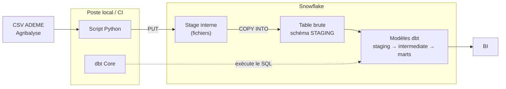

Trial Snowflake activé le 21/07/2026 — échéance ~20/08/2026 (30 j OU 400$, premier atteint)

# agribalyse — Analytics dbt

Projet dbt en cours de construction sur les données agribalyse, millésime 3.2 du 27 février 2025, fichier distribué sous le nom agribalyse-31-detail-par-ingredient.csv.

Agribalyse est une base de données qui indique l'impact environnemmental des produits agricoles qui sont produits ou consommés en France. Elle a pour but de soutenir la transition environnementale des systèmes agricoles et alimentaires.

**Source** : https://data.ademe.fr/datasets/agribalyse-31-detail-par-ingredient

## Stack

- Python 3.10.12 (pandas)
- dbt Core 1.12.0
- Snowflake

## Structure du projet

- `data/`                  Données brutes téléchargées (CSV de ADEME)
- `exploration.md`         Notes d'exploration du dataset
- `01_setup.sql`           Script sql pour le setup dans Snowflake  
- `02_load.py`             Transfert du CSV local téléchargé manuellement depuis ADEME vers Snowflake
- `requirements.txt`       Dépendances Python
- `docs`                   Documentations 

## Installation

## Exemples de requêtes business

## Contrôles d'intégration (CI/CD)

Un pipeline Github Actions va valider automatiquement le projet à chaque changement. Il va reconstruire l'ensemble des modèles dbt et effectuer les tests (métier et d'intégrité) sur une machine (runner github) reconstruite à chaque fois. Si une étape échoue, le pipeline empêche le merge donc main reste propre.

Sur ce projet :
- **Déclencheur** : Sur *pull request* (valider avant le merge) et sur *push* vers `main` (rejouer après le merge).
- **Environnement** : Le runner exécute dbt, qui se connecte à mon compte Snowflake, et l'isolation vient de la cible ci (schémas préfixés).
- **Build + Tests** : `dbt deps` installe les dépendances, puis `dbt build` construit les modèles dans l'ordre du DAG en lançant data tests. Le pipeline s'arrête au premier échec rencontré.
- **Traçabilité** : Les artefacts dbt (`manifest.json`, logs) sont conservés à chaque run.
- **Nota Bene** : Contrairement au projet 1 je n'ai pas ajouté de Slim CI.Pour ajoute cela il faudrait un manifest de référence, donc state:modified+ et --defer. Ayant que 6161 lignes, un build complet est négligeable. 

## Réconciliation

| Étape                                        | Compte             |
| -------------------------------------------- | ------------------ |
| RAW STAGING.AGRIBALYSE_DETAIL_PAR_INGREDIENT | 6161               |
| stg_agribalyse_detail_par_ingredient         | 6161               |
| fct_agribalyse                               | 6161               |

On voit bien que tout au long du processus de transformation le compte n'a pas changé vu qu'il n'y a pas de filtre, d'agrégation et de dédoublonnage.
On ne perd ni ne crée aucune donnée.

## Limites assumées

## Architecture 

## Documentation

## Ce que j'ai appris
