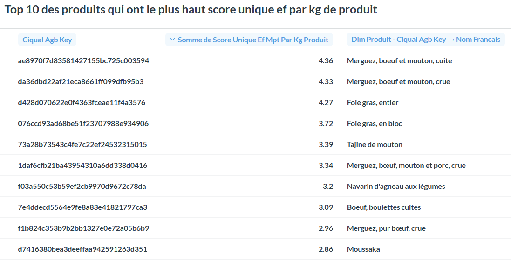
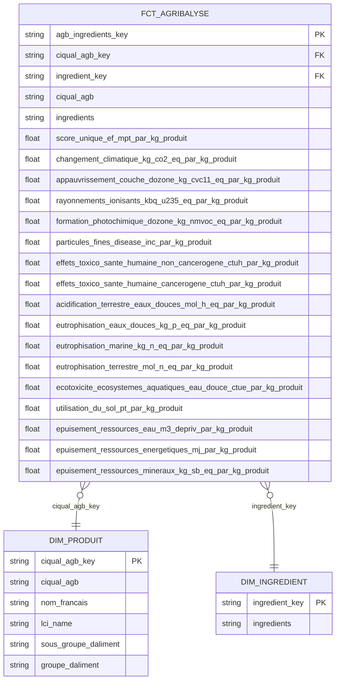
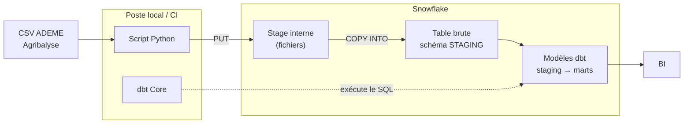
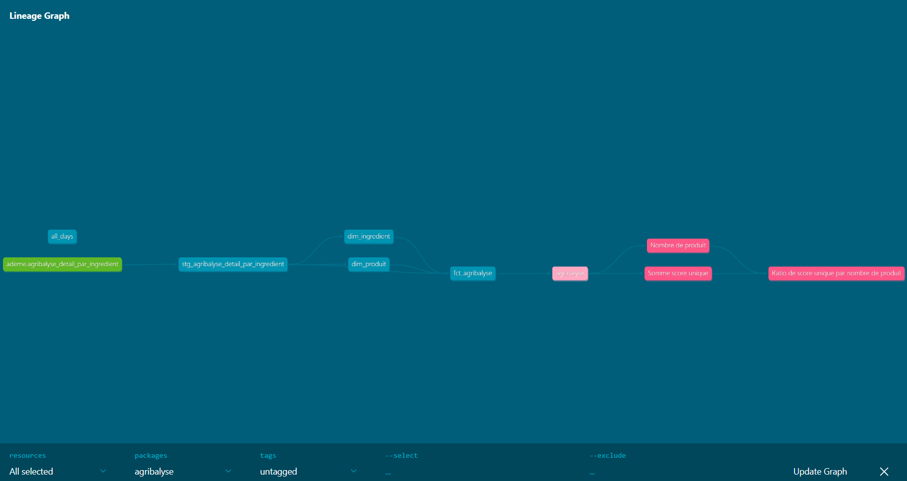

[](https://github.com/valentino014/agribalyse/actions/workflows/ci.yml)

# agribalyse — Analytics dbt

Projet dbt sur les données agribalyse, millésime 3.2 du 27 février 2025, fichier distribué sous le nom agribalyse-31-detail-par-ingredient.csv.

Agribalyse est une base de données qui indique l'impact environnemental des produits agricoles qui sont produits ou consommés en France. Elle a pour but de soutenir la transition environnementale des systèmes agricoles et alimentaires.

**Source** : https://data.ademe.fr/datasets/agribalyse-31-detail-par-ingredient

## Stack

- Python 3.10.12 (pandas)
- dbt Core 1.11.7
- Snowflake 1.12.0 (plugin)

## Structure du projet

- `data/`                  Données brutes téléchargées (CSV de ADEME)
- `exploration.md`         Script d'exploration du dataset
- `01_setup.sql`           Script sql pour le setup dans Snowflake  
- `02_load.py`             Transfert du CSV local téléchargé manuellement depuis ADEME vers Snowflake
- `requirements.txt`       Dépendances Python
- `docs`                   Documentations 
- `dbt_project`            Projet dbt
- `DECISIONS.md`           Documentation sur les décisions prise dans ce projet
- `PARKING.md`             Documentation des éléments pas terminés

## Installation

1. Cloner le repo
```bash
git clone https://github.com/valentino014/agribalyse.git
cd agribalyse
python3 -m venv venv
# Linux/Mac
source venv/bin/activate
# Windows
venv\Scripts\activate
```

2. Installer les dépendances:
```bash
pip install -r requirements.txt
```

3. Télécharger le CSV depuis ADEME :
   - Aller sur https://data.ademe.fr/datasets/agribalyse-31-detail-par-ingredient
   - Exporter en CSV et placer le fichier dans `data/agribalyse-31-detail-par-ingredient.csv`

4. Configurer les variables d'environnement :
```bash
cp .env.example .env
```

5. Exécuter le fichier `01_setup.sql` dans Snowflake

6. Exécuter le fichier `02_load.py` :
```bash
python3 02_load.py
```
Ce script lit `data/agribalyse-31-detail-par-ingredient.csv` et suit les étapes suivante :
PUT → stage interne → COPY INTO dans la table `DATABASE_AGRIBALYSE.STAGING.AGRIBALYSE_DETAIL_PAR_INGREDIENT` de Snowflake (peut prendre quelques minutes).

7. Installer les packages dbt :
```bash
cd dbt_project
dbt deps
```

8. Configurer la connexion Snowflake :
   Vérifier que `~/.dbt/profiles.yml` est configuré pour pointer vers votre Snowflake.

9. Construire et tester le projet :
```bash
dbt build
```

## Exemples de requêtes business

### Récupérer le total du score unique ef par produit
```sql
select dpr.nom_francais, fa.ciqual_agb, sum(score_unique_ef_mpt_par_kg_produit) somme_score_ef_par_kg_produit
from fct_agribalyse fa
left join dim_produit dpr on fa.ciqual_agb_key = dpr.ciqual_agb_key 
group by fa.ciqual_agb, dpr.nom_francais;
```

## Les métriques

- nb_produit_distinct : Donne le nombre total de produit.
- somme_score_unique_ef_par_kg_de_produit : somme total du score unique par kg de produit.
- ratio_score_unique_ef_par_kg_produit_par_nb_produit : ratio des score unique par kg de produit diviser par le nombre de produit.



## Contrôles d'intégration (CI/CD)

Un pipeline GitHub Actions va valider automatiquement le projet à chaque changement. Il va reconstruire l'ensemble des modèles dbt et effectuer les tests (métier et d'intégrité) sur une machine (runner github) reconstruite à chaque fois. Si une étape échoue, le pipeline empêche le merge donc main reste propre.

Sur ce projet :
- **Déclencheur** : Sur *pull request* (valider avant le merge) et sur *push* vers `main` (rejouer après le merge).
- **Environnement** : Le runner exécute dbt, qui se connecte à mon compte Snowflake, et l'isolation vient de la cible ci (schémas préfixés).
- **Build + Tests** : `dbt deps` installe les dépendances, puis `dbt build` construit les modèles dans l'ordre du DAG en lançant data tests. Le job finit rouge en cas d'échec rencontré.
- **Traçabilité** : Les artefacts dbt (`manifest.json`, logs) sont conservés à chaque run.
- **Nota Bene** : Contrairement au projet 1 je n'ai pas ajouté de Slim CI. Pour l'ajouter il faudrait un manifest de référence, donc state:modified+ et --defer. Avec seulement 6161 lignes, un build complet est négligeable. 

## Réconciliation

| Étape                                        | Compte             |
| -------------------------------------------- | ------------------ |
| RAW STAGING.AGRIBALYSE_DETAIL_PAR_INGREDIENT | 6161               |
| stg_agribalyse_detail_par_ingredient         | 6161               |
| fct_agribalyse                               | 6161               |

On voit bien que tout au long du processus de transformation le compte n'a pas changé vu qu'il n'y a pas de filtre, d'agrégation et de dédoublonnage.
On ne perd ni ne crée aucune donnée.

## Limites et pistes

- Ratio score/nb_produit : double comptage ou pas ? Vérifier qu'un produit connu somme à son score publié. Le décalage de grain n'est pas le problème.
- expr: ciqual_agb dans la mesure nb_produit : vérifier si c'est la clé naturelle ou une résolution accidentelle. Aligner ou justifier.
- Regroupement lisible par produit — route A (dimension catégorielle sur le fait, donne 11182) ou route B (semantic model sur dim_produit, donne nom_francais). À trancher.
- Semantic model sur dim_ingredient.
- Colonne eau + les autres colonnes d'impact.
- Warning --show-all.


Questions Metabase groupées sur codes, pas sur libellés. Choisir le mécanisme de jointure.

## Schéma en étoile 



## Architecture 



## Documentation

La chaîne complète, de la source ADEME aux 3 métriques : staging → dimensions → fait → couche sémantique : 



## Ce que j'ai appris

- Mise en place de la connexion Snowflake pour transférer les données du csv vers le staging.
- Structuration d'un projet dbt séparant données brutes et modélisation 
- Ajout de test pour valider les données